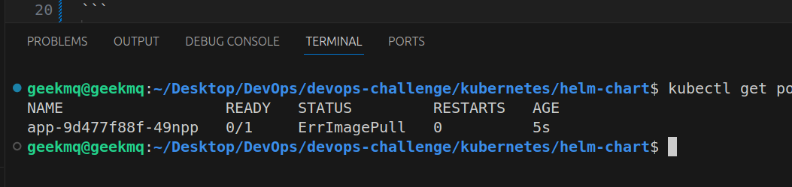
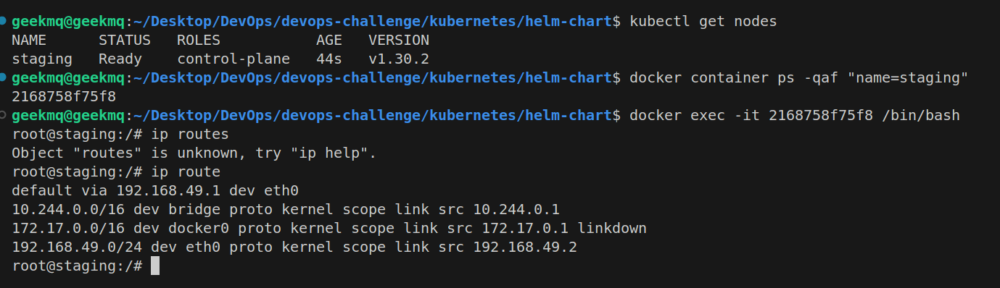
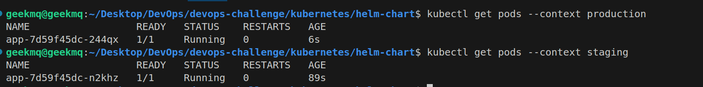

# Technical decisions

## Mininikube Networks Issues with the Registry

- Using ip: 192.168.49.1
- Add registry as part of insecure registries in minikube and local docker

Connecting to the local registry form minikube was a more complex than I expected. The major issue was to be able to connect the minikube cluster with the local registry running as container external to minikube, `localhost` was not visible from the containers running in kubernetes, and image pullBackoff error was present all the time.


In the past I used `host.docker.internal`, but using it didn't help, it was not possible to reach the external registry. So after long research, discovered that this host is only available in `windows/mac` and decided to explore network options, like running all containers under the same network, but it was not successfull.
Finally after some time reading a post, found that linux normally deploys minikube with the default route `192.168.49.1` which allow you to connect to the host machine localhost, i.e. Jenkins is running in `localhost:8080` you can exec into the master node and run `curl http://192.168.49.1:8080` it will return the base html page, which helped me to make the decition to use the ip address to connect the registry.




## Environments

To deploy the multi environment I faced some issues, starting from the tfstate preservation, I started using git, but the problem with it, is that is as simple as using terraform backend option with an s3 bucket, and I could confirm it, while trying to install multiple environments (local,staging), it cause many problems and manual workarounds, so decided to test using s3 compatible minio, which I used in the past, but not to store terraform tfstates.

Using Terraform with backend pointing to minio was very helpful, and then it introduced another issue, which was the fact that you cannot modify the backend config with variables, so following the best practices and terraform documentation found that the backend config can be overwritten using `-backend-config=<key name>`. In the below example is specified how to change the tfstate per environment, and re-using the same code but changing the `ENVIRONMENT` is possible to deploy N number of clusters.

`Loop to install the 3 envs in one step`
``` 
    terraform init -reconfigure \
    -backend-config="profile=default" \
    -backend-config="endpoint=http://localhost:9000" \ # minio url
    -backend-config="key=kubernetes/$ENVIRONMENT.tfstate" # where to store the inputs into the bucket specified in terraform/backend.tf
    terraform apply -auto-approve=true -var-file=./environments/$ENVIRONMENT/inputs.tfvars # inputs contains default values and cluster name local,staging,production
```
Also after using this approach I had a big doubt, if the local registry was accessible from the same ip, and i did a quick research and the answer was yes it works fine and is able to see the registry under `192.168.49.1:5000`
