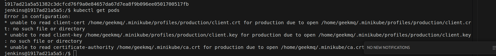

# Technical decisions

## Improvements
- Decouple architecture in general, one project for infrastructure other for apps.
- Implement cicd project to be able to version the pipes and share across other teams/projects
- Use jenkins libraries.
- Even if the ip 192.168.49.1 works to have access to kubernetes an registry, I feel special need to research more and define a way to set specific ip to avoid conflicts, similar to Windows/Mac using `host.docker.internal` which does not exist in Linux.

## Mininikube Networks Issues with the Registry

- Using ip: 192.168.49.1
- Add registry as part of insecure registries in minikube and local docker

Connecting to the local registry form minikube was a more complex than I expected. The major issue was to be able to connect the minikube cluster with the local registry running as container external to minikube, `localhost` was not visible from the containers running in kubernetes, and image pullBackoff error was present all the time.


In the past I used `host.docker.internal`, but using it didn't help, it was not possible to reach the external registry. So after long research, discovered that this host is only available in `windows/mac` and decided to explore network options, like running all containers under the same network, but it was not successfull.
Finally after some time reading a post, found that linux normally deploys minikube with the default route `192.168.49.1` which allow you to connect to the host machine localhost, i.e. Jenkins is running in `localhost:8080` you can exec into the master node and run `curl http://192.168.49.1:8080` it will return the base html page, which helped me to make the decition to use the ip address to connect the registry.


## Jenkins & kubernetes Network Issues

Deploying kuberentes was not difficult, but making jenkins to connect to kubernetes was tricky, due to a weird behavior of my terraform deployment, which was creating a custom network with the cluster name, but the issues is, since this is multi cluster deployment, adding multi network connection to the container, it caused timeouts.
The solution attempted was to mount all in host network, but for some reason didn't work, ultil switched all, jenkins, and all minikube clusters to network bridge, then it started responding the requests `curl https://192.168.49.2:8443` from the jenkins container.

After being able to ping kubernetes, discovered more issues, this time the kube config was not functional for jenkins, due to it had references to local computer, basically the certs:



At this point I had two ideas, one, to mount the entire kubeconfig, or find how to incorporate the secret within the config without references.
After some time, I found a way to format without cert paths, using `kubectl config view --minify --flatten` this removes the patsh and puts directly the certs into the config, so this can now be used as a jenkins secret, and be referenced simply:

First create the jenkins secret `kube-config`, then use below code snipped in the jenkinsfile
```
    withCredentials([file(credentialsId: 'kube-config', variable: 'KUBE_CONFIG')]) {
    sh '''
    KUBECONFIG=$KUBE_CONFIG
    helm install 
    '''            
    }  
```

## Jenkins Agents
After some time attempting to use Jenkins Agents, and several errors related to access in the agent folder with write permissions, I decided to simply update `jenkins/jenkins:lts` docker image to include all libraries on it.

I know is not a good practice and is one of the reasons why I was trying to use Agents, but due to time limitations and more problems to resolve, to be able to make progress faster and resolve this issue later, I decided to do.

## Environments

To deploy the multi environment I faced some issues, starting from the tfstate preservation, I started using git, but the problem with it, is that is as simple as using terraform backend option with an s3 bucket, and I could confirm it, while trying to install multiple environments (local,staging), it cause many problems and manual workarounds, so decided to test using s3 compatible minio, which I used in the past, but not to store terraform tfstates.

Using Terraform with backend pointing to minio was very helpful, and then it introduced another issue, which was the fact that you cannot modify the backend config with variables, so following the best practices and terraform documentation found that the backend config can be overwritten using `-backend-config=<key name>`. In the below example is specified how to change the tfstate per environment, and re-using the same code but changing the `ENVIRONMENT` is possible to deploy N number of clusters.

`Loop to install the 3 envs in one step`
``` 
    terraform init -reconfigure \
    -backend-config="profile=default" \
    -backend-config="endpoint=http://localhost:9000" \ # minio url
    -backend-config="key=kubernetes/$ENVIRONMENT.tfstate" # where to store the inputs into the bucket specified in terraform/backend.tf
    terraform apply -auto-approve=true -var-file=./environments/$ENVIRONMENT/inputs.tfvars # inputs contains default values and cluster name local,staging,production
```
Also after using this approach I had a big doubt, if the local registry was accessible from the same ip, and i did a quick research and the answer was yes it works fine and is able to see the registry under `192.168.49.1:5000`


## Security Considerations

- Docker in Docker is not safe, and it gives too much access to the host machine, to reduce this risk I decided to use buildah, which does not require to mount the `/var/run/docker.sock`.
- Instead of mounting the kube config as volume, it was approached with Jenkins secrets to store a minified version of it.
- Modify Jenkins controller, installing binaries into it, is not a good practice, but due to time limitations was the selected approach.
- Exposing my localhost to the public network is not a good idea, but for this project was the only way to be able to trigger a webhook from jenkins, this using ngrok, which was the simplest way, working at the first attemp.

