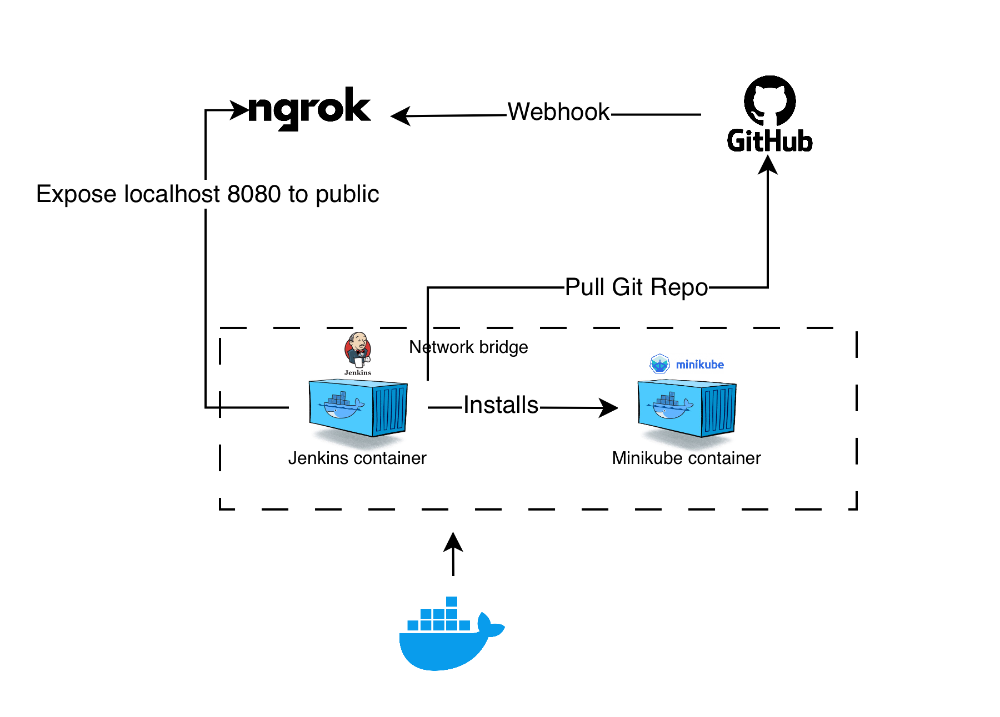

## Architecture Overview

`kubectl config view --minify --flatten`



- Build docker iamges buildah
- Nodejs due to recently used it with typescript
- Helmcharts vs plain templates
- minikube terraform open source version over minikube bash
- trivy


```
    #!/bin/bash

    source ./util.bash

    DEPENDENCIES_DIR=./dependencies

    download_kubectl(){
    curl -LO "https://dl.k8s.io/release/$(curl -L -s https://dl.k8s.io/release/stable.txt)/bin/linux/amd64/kubectl"
    }

    download_minikube (){
    curl -LO https://github.com/kubernetes/minikube/releases/latest/download/minikube-linux-amd64
    }
    
    setup_minikube (){
    log "setup_minikube: cd ../dependencies"
    cd ../dependencies
    log "setup_minikube: sudo install minikube-linux-amd64 /usr/local/bin/minikube"
    sudo install minikube-linux-amd64 /usr/local/bin/minikube
    log "setup_minikube: cd .."
    cd ../scripts
    }

    start_up (){
    log "start_up: minikube start --driver=docker"
    minikube start --cpus 6 --memory 8000 --driver=docker --insecure-registry "192.168.49.1:5000"
    log "start_up: minikube config set driver docker"
    minikube config set driver docker
    }

    uninstall_minikube(){
    log "uninstall_minikube: minikube stop..."
    minikube stop
    log "uninstall_minikube: minikube delete..."
    minikube delete
    log "uninstall_minikube: sudo apt-get remove minikube..."
    sudo apt-get remove minikube
    log "uninstall_minikube: sudo rm /usr/local/bin/minikube..."
    sudo rm /usr/local/bin/minikube
    }

    set_up_kubectl(){
    log "set_up_kubectl: cd ../dependencies..."
    cd ../dependencies
    log "set_up_kubectl: sudo cp kubectl /usr/local/bin/"
    sudo cp kubectl /usr/local/bin/
    }

    remove_kubectl(){
    log "remove_kubectl: sudo rm -rf  /usr/local/bin/kubectl"
    sudo rm -rf  /usr/local/bin/kubectl
    }

    set_up_working_dir(){
    rm -r $DEPENDENCIES_DIR
    mkdir -p $DEPENDENCIES_DIR
    download_kubectl
    download_minikube
    }

    install_minikube() {
    log "install_minikube prepare dependencies folder..."
    set_up_working_dir
    log "install_minikube install_minikube..."
    setup_minikube
    log "install_minikube set_up_kubectl..."
    set_up_kubectl
    log "install_minikube start_up..."
    start_up
    log "install_minikube enable_addons..."
    enable_addons
    }

    enable_addons(){
    log "enable_addons: minikube addons enable ingress..."
    minikube addons enable ingress
    }
```

## Live Demo
- Show the working application
- Trigger the CI/CD pipeline
- Demonstrate key features

## Technical Deep Dive

- Code walkthrough (focus on interesting parts)
- Security implementations
- Challenges faced and solutions