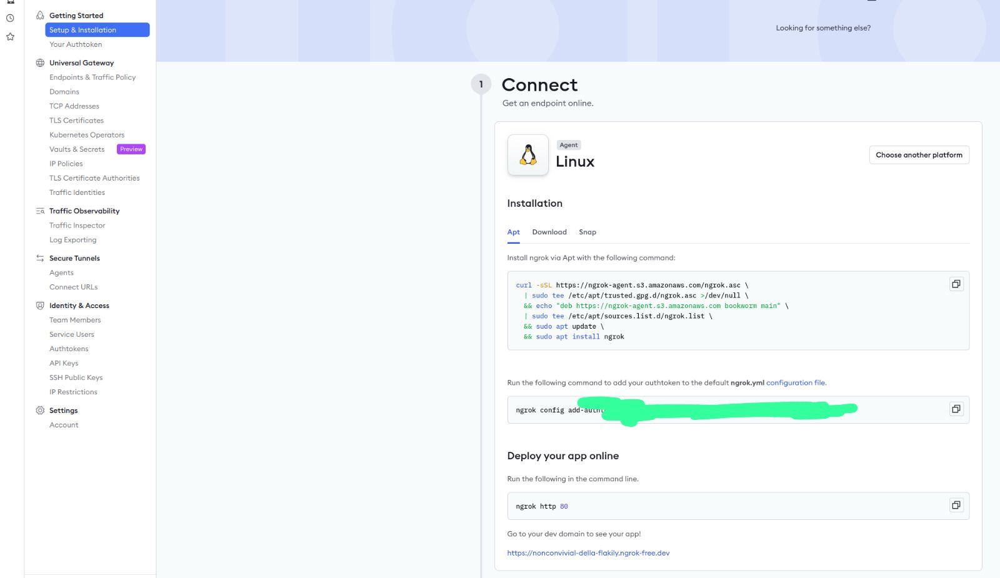
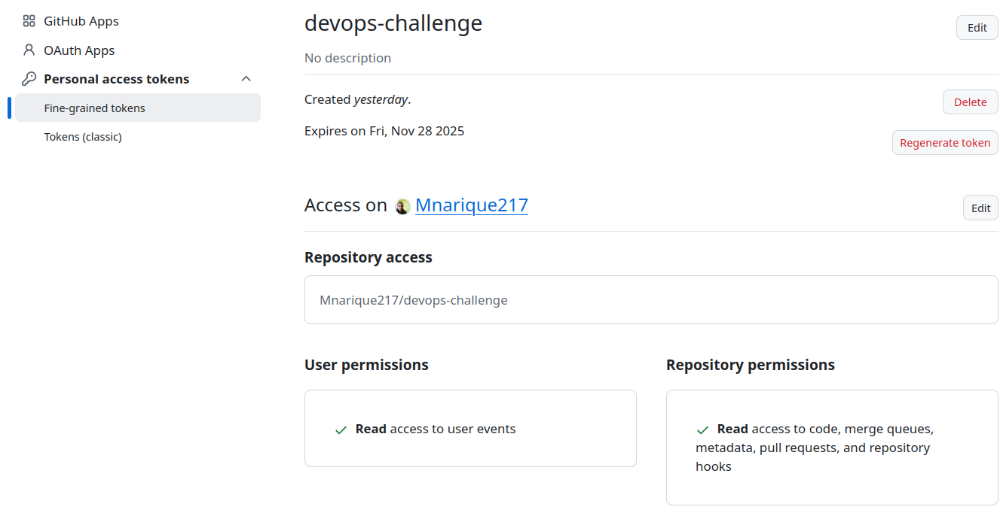
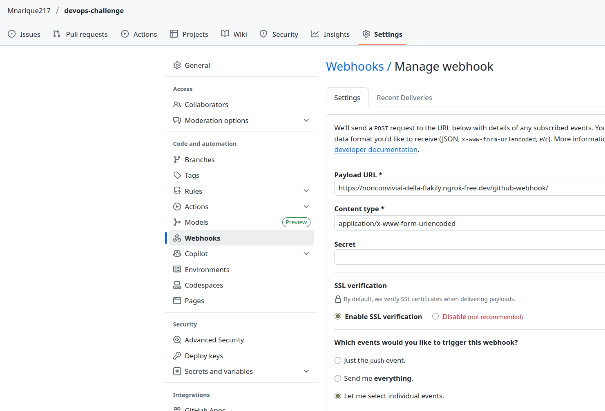
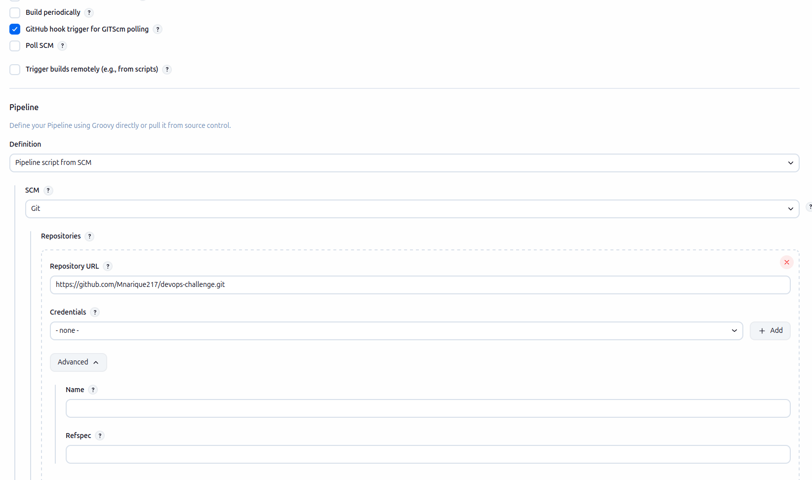
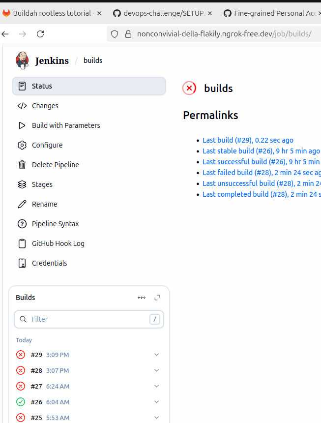

## Github webhook


## Pre-requisites

- minio s3 for terraform tfstate
- Docker
- Terraform
- Build jenkins custom Dockerimage

### Build Jenkins docker image

```
cd jenkins
docker build . -t jenkins/jenkins:lts-dev
```

### Deploy minio
`run following bash to deploy in docker container`

```
cd scripts && bash cli.bash -i-s3
## or use below code 
install_s3() {
    sudo mkdir -p ~/.aws
    password=$(tr -dc 'A-Za-z0-9!?%=' < /dev/urandom | head -c 10)

sudo tee ~/.aws/credentials > /dev/null <<EOF
[default]
aws_access_key_id = admin
aws_secret_access_key = $password
EOF
    docker stop minio || true
    docker rm minio || true
    docker run -d \
    --name minio \
    -p 9000:9000 \
    -p 9001:9001 \
    -e "MINIO_ROOT_USER=admin" \
    -e "MINIO_ROOT_PASSWORD=$password" \
    -v ~/minio-data:/data \
    minio/minio server /data --console-address ":9001"
}
```
### Deploy Terraform

```
cd scripts && bash cli.bash-i-terraform
# Use following bash or cli
install_terraform(){
    # latest open source version
    TERRAFORM_VERSION="1.5.7"
    wget https://releases.hashicorp.com/terraform/${TERRAFORM_VERSION}/terraform_${TERRAFORM_VERSION}_linux_amd64.zip
    unzip terraform_${TERRAFORM_VERSION}_linux_amd64.zip
    sudo mv terraform /usr/local/bin/
}
```

### Run Jenkins as Container

```
cd scripts && bash cli.bash -i-jenkins
```

---

### Expose Jenkins to be visible for github (optional)

For this is required to expose local Jenkins to the public network, there are multiple services, but one that worked at first was `https://dashboard.ngrok.com/get-started/setup/linux`.

- create an account if not already creted.
- go to https://dashboard.ngrok.com/get-started/setup/linux, select you OS, in my case Linux.
- Follow the instructions to install it and make sure your jenkins is up to be able to see it in the provided url.



`Install ngrok and add the token`
```
curl -sSL https://ngrok-agent.s3.amazonaws.com/ngrok.asc \
  | sudo tee /etc/apt/trusted.gpg.d/ngrok.asc >/dev/null \
  && echo "deb https://ngrok-agent.s3.amazonaws.com bookworm main" \
  | sudo tee /etc/apt/sources.list.d/ngrok.list \
  && sudo apt update \
  && sudo apt install ngrok

  ngrok config add-authtoken <your token>
```
`Finally expor your port` and use the output of the script to copy the new dns.

```
ngrok http 8080
```
### Create the Webhook in Github

- Github token is required with minimal permisions, push,pull, merge request
- Read access to code
- merge queues
- metadata
- pull requests
- repository hooks 



In the Github repository:

- Go to `https://github.com/Mnarique217/devops-challenge/settings/hooks/new`
- Do login
- Set the url of your jenkins, in previous step the command `ngrok http 8080` exposed the url `https://nonconvivial-della-flakily.ngrok-free.dev/`
- Concat the following subpath github-webhook/ make sure to include / at the end like following result: `https://nonconvivial-della-flakily.ngrok-free.dev/github-webhook/`
select te events:
- merge request (this case there is only one jenkins file but is to test the hook)
- push

`example:`



### Enable in the Pipe the github Webhook
In Jenkins:

- go to https://nonconvivial-della-flakily.ngrok-free.dev/job/builds/configure or your domain created by ngrok and the created pipe
- Enable `GitHub hook trigger for GITScm polling?`
- Create a new credential using the token created in step #1, this of type text and with the id of your preference, in my case github-webhook
- Clic Save and push something to your branch, the hook should trigger your pipe.

`Enable webhook`


`Set token`


`Webhook working` In this case failed the pipe but due to jenkis pipe errors


###